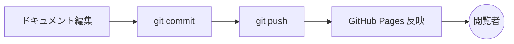
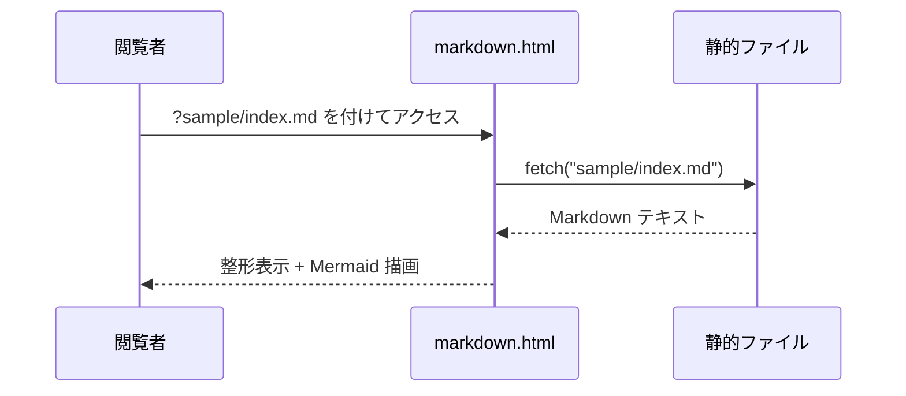
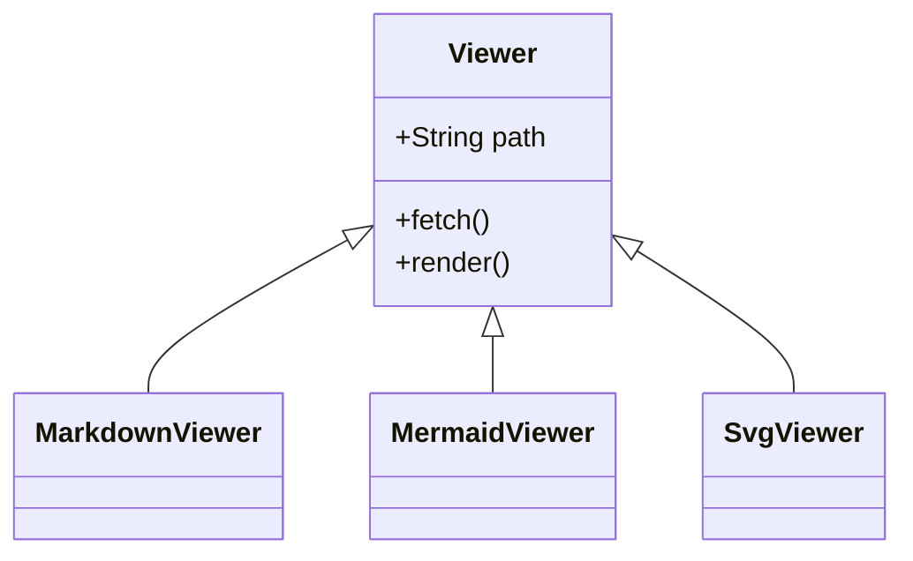

# サンプル: ビューア機能ガイド

このページは `markdown.html` で表示するためのサンプルです。
本リポジトリの **Markdown / Mermaid / SVG** ビューアが備える機能を一通り
体験できます。

> 推奨アクセス方法: ローカルでは `python3 -m http.server 8000` を起動し、
> `http://localhost:8000/markdown.html?sample/index.md` を開く。
> GitHub Pages 上では `…/markdown.html?sample/index.md` で同じ表示になる。

---

## 1. 見出しと書式

### H3 見出し

#### H4 見出し

段落の中には **太字**, *斜体*, ~~取り消し線~~, `インラインコード`,
[外部リンク](https://pages.github.com/) を混在させられます。

> 引用ブロックはこのように左罫線つきで表示されます。
> 設計上の注意点や、後で確認したいメモを目立たせるのに便利。

---

## 2. リスト

順序なしリスト(ネスト):

- 親項目 A
  - 子項目 A-1
  - 子項目 A-2
    - 孫項目 A-2-a
- 親項目 B

順序つきリスト:

1. ドキュメントを編集する
2. `git commit` する
3. `git push` する
4. GitHub Pages 側で自動反映される

---

## 3. コードブロック

言語タグを付けると、コードブロックとして整形表示されます。

```python
def greet(name: str) -> str:
    return f"Hello, {name}!"

print(greet("topicmaker-team"))
```

```sh
# ローカルでプレビュー
python3 -m http.server 8000
# ブラウザで以下を開く
# http://localhost:8000/markdown.html?sample/index.md
```

```json
{
  "name": "Pages",
  "purpose": "topicmaker-team のドキュメント共有",
  "viewers": ["markdown.html", "mermaid.html", "svg.html"]
}
```

---

## 4. 表 (GFM テーブル)

| 拡張子      | ビューア          | URL 例                              |
| ----------- | ----------------- | ----------------------------------- |
| `.md`       | `markdown.html`   | `markdown.html?sample/index.md`     |
| `.mermaid`  | `mermaid.html`    | `mermaid.html?sample/diagram.mermaid` |
| `.svg`      | `svg.html`        | `svg.html?sample/figure.svg`        |

---

## 5. インライン Mermaid 図

Markdown 内の ```` ```mermaid ```` コードブロックは、ページ内で
そのまま図として描画されます。各図には次のツールバーが付きます。

- `−` / `+` / `⟲` … 拡大・縮小・リセット
- `Source` … Mermaid の元ソースを表示
- `SVG` … 描画結果を SVG ファイルとしてダウンロード

### フローチャート



### シーケンス図



### クラス図



---

## 6. その他のサンプル

別ファイルとして用意した Mermaid / SVG も、それぞれ専用ビューアで確認できます。

- [Mermaid 単体ファイル → mermaid.html](../mermaid.html?sample/diagram.mermaid)
- [SVG ファイル → svg.html](../svg.html?sample/figure.svg)

---

## 7. ヘッダの "Source" ボタン

ページ最上部の `Source` ボタンを押すと、整形前の Markdown ソースが
そのまま表示されます。もう一度押すと描画表示に戻ります。
